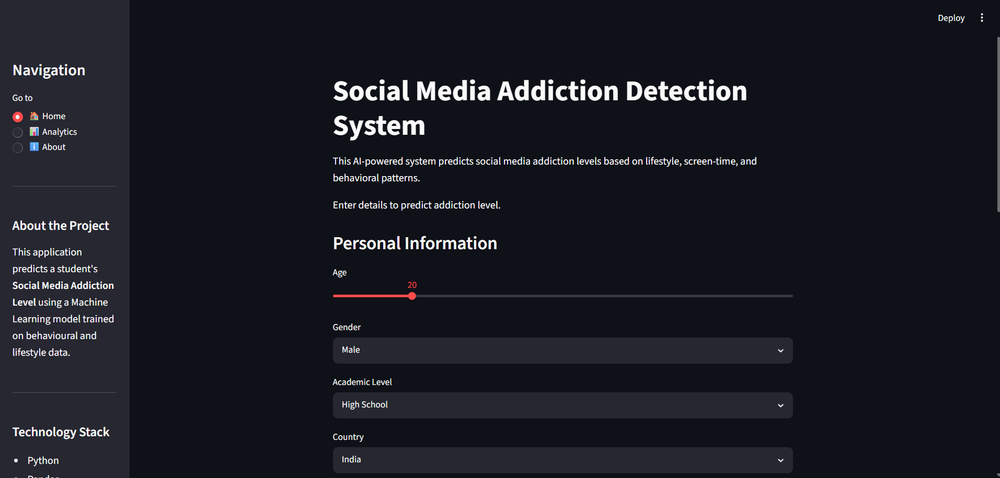

# social-media-addiction-detector
an social media addiction detector machine learning model
# 📱 Social Media Addiction Detection System

A Machine Learning-powered web application that predicts a student's social media addiction level based on lifestyle, usage patterns, and mental health indicators. The application is built using a Random Forest Classifier with a FastAPI backend and a Streamlit frontend.

---

## 🚀 Features

- Predicts Addiction Level (Low, Medium, High)
- Confidence Score for each prediction
- Personalized recommendations based on user inputs
- Interactive Analytics Dashboard
- FastAPI REST API
- Streamlit Web Interface
- Machine Learning model trained using Random Forest

---

## 🛠️ Tech Stack

- Python
- Scikit-learn
- Pandas
- NumPy
- Matplotlib
- Seaborn
- Streamlit
- FastAPI
- Uvicorn

---

## 📂 Project Structure

```text
social-media-addiction-detector/
│── app/
│── api/
│── assets/
│── data/
│── models/
│── README.md
│── requirements.txt
```

---

## 📷 Screenshots

### Home Page



---

### Prediction Result


---

### Analytics Dashboard


---

### FastAPI Swagger Documentation


---

## ⚙️ Installation

Clone the repository:

```bash
git clone https://github.com/Nowhereman19/social-media-addiction-detector.git
```

Install dependencies:

```bash
pip install -r requirements.txt
```

Run the FastAPI backend:

```bash
python -m uvicorn api.main:app --reload
```

Run the Streamlit app:

```bash
python -m streamlit run app/app.py
```

---

## 📊 Machine Learning Pipeline

- Data Cleaning & Preprocessing
- Label Encoding
- Exploratory Data Analysis (EDA)
- Random Forest Classification
- Model Evaluation
- Model Serialization using Pickle
- API Integration
- Frontend Integration

---

## 👨‍💻 Author

**Kush Sharma**

B.Tech Computer Science Engineering  
Jaypee University of Engineering and Technology